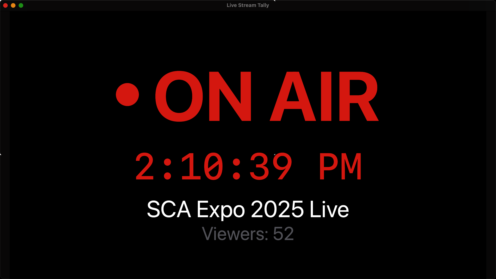
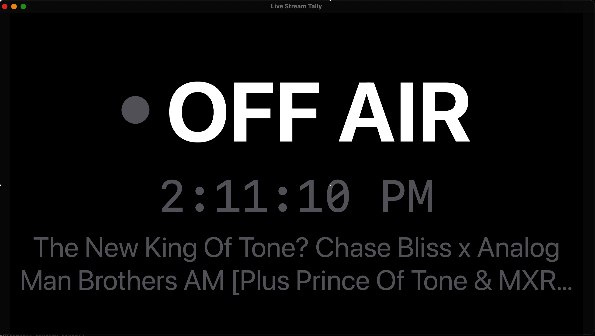
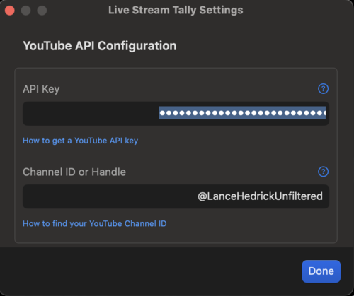
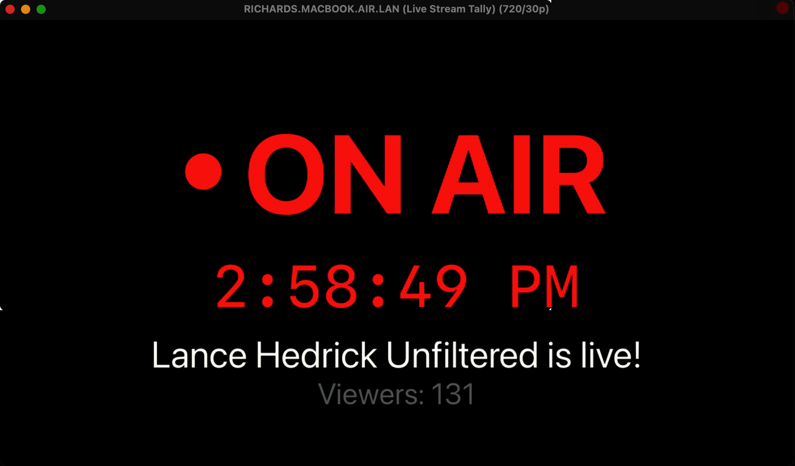

# Live Stream Tally

[](https://swift.org)
[](https://www.apple.com/macos/)
[](LICENSE)
[](https://cursor.com/)
[](https://www.richardbolt.com/live-stream-tally/)

NDI-ready on-air status for any YouTube live streaming channel. Live Stream Tally connects to the YouTube Data API to check a YouTube channel's live status and emits an NDI tally signal.

This is a niche macOS application in that there is limited use for displaying a YouTube channel's live streaming status, or "tally", using NDI output. However, this is perfect for live streamers who want to monitor channel YouTube live status and integrate it with streaming software, like OBS or Wirecast, that support NDI. It's particularly useful for operators using a Multi Viewer.

This is a niche app and you'll know if you need it! 

## Features

- Real-time monitoring of a YouTube channel live status:
    - Clear ON AIR/OFF AIR indication
    - Current time
    - Live Stream title
    - Viewer count
- NDI output at 720p for integration with streaming software or Multi Viewers
- NDI Tally signal for integration with production equipment
- Dark mode support
- Native macOS app with modern SwiftUI interface
- Zero data collection - your streaming data stays on your device

For more details about the app, visit [Live Stream Tally website](https://www.richardbolt.com/live-stream-tally/).

## Screenshots


*Live Stream Tally showing a live stream with viewer count*


*Live Stream Tally showing the off air view*



*Configure your YouTube API key and a channel ID/handle*


*Live Stream Tally showing the On Air view sent via NDI Broadcast to NDI Video Monitor*

## Requirements

### Runtime Requirements
- macOS 13.0 or later
- [YouTube Data API v3 key](https://developers.google.com/youtube/v3/getting-started)

### Development Requirements
- Swift 6.1 or later
- Xcode 15.3 or later
- [NDI Runtime](https://www.ndi.tv/tools/) installed

## Setup

1. Install the NDI Runtime from [NDI.tv](https://www.ndi.tv/tools/)
2. Get a YouTube Data API key from the [Google Cloud Console](https://console.cloud.google.com/)
3. Find your YouTube Channel ID
    1. You can use a Channel Handle
4. Build and run the app:
   ```bash
   make
   make run
   ```

## Development

This project uses Swift Package Manager for dependency management. To work on the project:

1. Clone the repository
2. Open the project in Xcode or your preferred editor (like Cursor in which this app was built!)
3. Run `make` or `make build` to build the project
4. Run `OS_ACTIVITY_MODE=debug make run` to run the app in debug mode

Available make commands:
```bash
make          # Clean and build the app
make clean    # Remove build artifacts
make build    # Build the app and create app bundle
make run      # Run the app
make sign     # Sign the app (use SIGN_IDENTITY env var to specify identity)
make package  # Create a distributable zip package
make test     # Run Swift tests
make logs     # Stream debug+ level logs from the app
make help     # Display help information
```

## Testing

LiveStreamTally includes a comprehensive test suite designed to ensure the application's reliability and correctness. The tests are structured to handle Swift 6.1's strict actor isolation and cover the major components of the application.

### Test Structure

The test suite is organized into the following test files:

- **YouTubeServiceTests**: Tests for the YouTube API integration
- **PreferencesManagerTests**: Tests for user preference storage and retrieval
- **MainViewModelTests**: Tests for the main view model functionality
- **NDIBroadcasterTests**: Tests for NDI broadcasting capabilities
- **UITests**: Tests for SwiftUI components

### Running Tests

You can run tests using one of the following methods:

1. To run all tests (requires NDI SDK installed):
   ```bash
   make test
   ```

2. To run specific tests without NDI dependencies:
   ```bash
   ./run_tests.sh YouTubeServiceTests
   ```

3. To run a specific test method:
   ```bash
   swift test --filter YouTubeServiceTests/testInitWithValidApiKey
   ```

### Actor Isolation in Tests

Since LiveStreamTally uses Swift 6.1's strict actor isolation with `@MainActor` on many of its classes, tests are designed to respect these isolation boundaries. Test methods that interact with actor-isolated code are properly marked with `@MainActor` and use the `async/await` pattern.

For more details about the test design, see the [Tests README](Tests/README.md).

## Contributing

Contributions to Live Stream Tally are welcome! Please read our [Contributing Guidelines](CONTRIBUTING.md) for details on how to submit changes and the process for reviewing pull requests.

By participating in this project, you agree to abide by our [Code of Conduct](CODE_OF_CONDUCT.md).

### Development Setup

1. Fork the repository
2. Clone your fork: `git clone https://github.com/YOUR_USERNAME/livestreamtally.git`
3. Create your feature branch: `git checkout -b feature/amazing-feature`
4. Install dependencies and build: `make`
5. Make your changes
6. Test your changes: `make test`
7. Commit your changes: `git commit -m "Add amazing feature"`
8. Push to the branch: `git push origin feature/amazing-feature`
9. Open a Pull Request

## License

This application is released under the MIT License. See the [LICENSE](LICENSE) file for details.

### Third-Party Components

- **NDI®**: NDI® is a registered trademark of Vizrt NDI AB. Use of the NDI SDK is subject to the NDI SDK License Agreement. More information is available at [ndi.video](https://ndi.video/).
- **Google APIs for Swift**: This project uses Google's API client libraries which are licensed under Apache 2.0. 