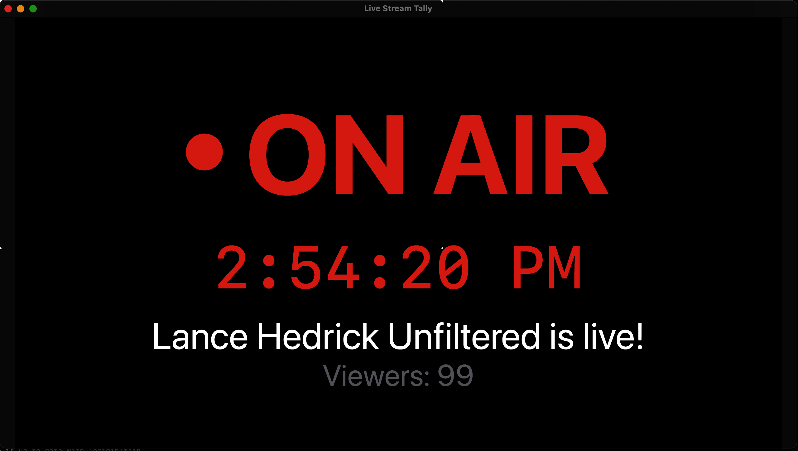
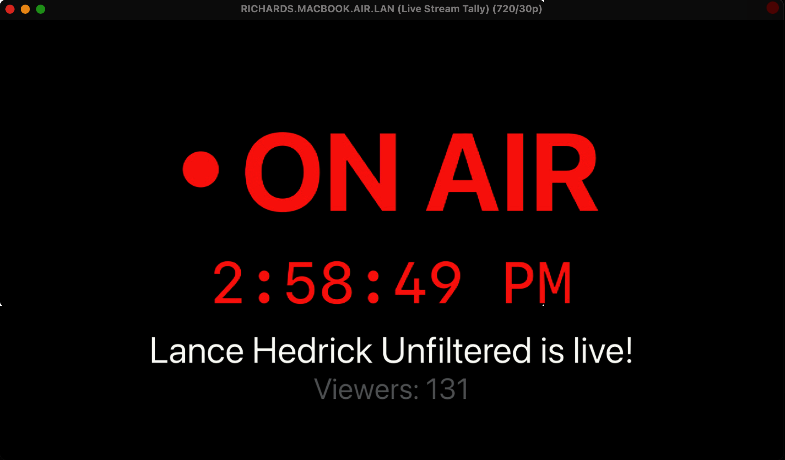

# Live Stream Tally Documentation

This directory contains documentation resources for the Live Stream Tally application.

## Screenshots

The `images` directory contains the following screenshots demonstrating the application's features and interface:

### Application Interface

| Screenshot | Description |
|------------|-------------|
|  | Main application showing ON AIR status (version 1) |
|  | Main application showing ON AIR status with viewer count (version 2) |
|  | Main application showing OFF AIR status (version 1) |
|  | Main application showing OFF AIR status (version 2) |
|  | Settings panel for configuring YouTube API key and channel ID/handle (version 1) |
|  | Settings panel for configuring YouTube API key and channel ID/handle (version 2) |

### NDI Integration

| Screenshot | Description |
|------------|-------------|
|  | Live Stream Tally ON AIR view in NDI Video Monitor |

### Multi-Viewer Integration

| Screenshot | Description |
|------------|-------------|
|  | Wirecast Multi-Viewer showing ON AIR status (version 1) |
|  | Wirecast Multi-Viewer showing ON AIR status (version 2) |
|  | Wirecast Multi-Viewer showing OFF AIR status |

## Using the Screenshots

These screenshots can be used for:

1. Documentation purposes
2. Marketing materials 
3. Explaining the application's features
4. Demonstrating NDI integration capabilities

All images are captured from the actual Live Stream Tally application and related software. 